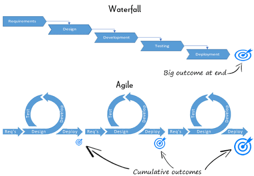
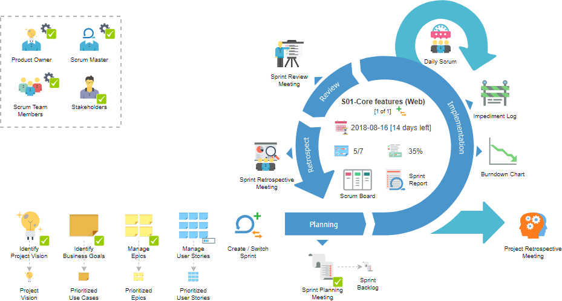
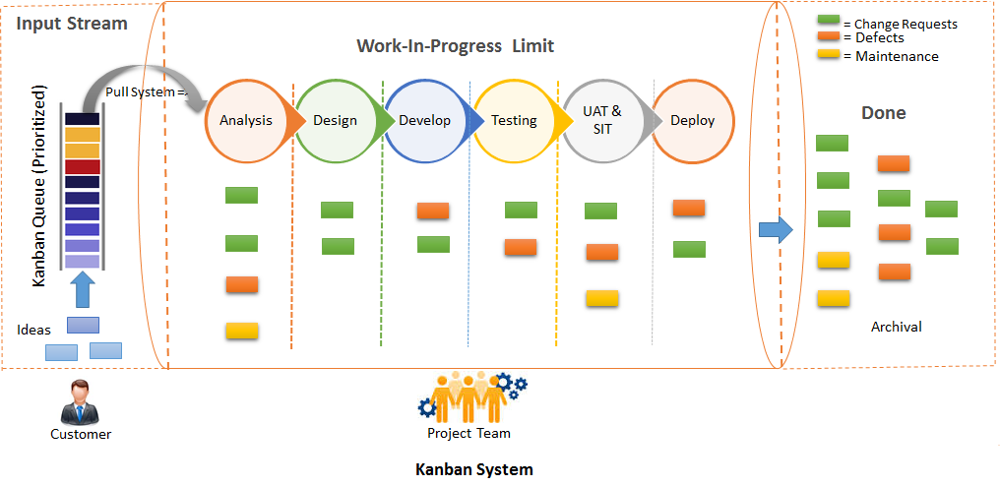

# Frontend Interview Kit

This repository contains a collection of resources for frontend developers prepared to get into the software industry. This is intended to be a guide for frontend developers to prepare for interviews and to get a better understanding of frontend development. It is not a complete and comprehensive guide, and is documented and shared in the site while self-learning and preparing for interviews.

## Table of Contents

- [Basics Setup](#basics-setup)
  - [Project Setup](#project-setup)
- [Web Fundamentals](#web-fundamentals)
  - [HTML](#html)
  - [CSS](#css)
    - [CSS Properties](#css-properties)
  - [JavaScript](#javascript)
    - [DOM Properties](#dom-properties)
  - [Project 1 - Create a simple calculator](#simple-calculator)
- [Frontend Frameworks/Libraries](#frontend-frameworks-libraries)
  - [Vite.js](#vitejs)
  - [Tailwind CSS](#tailwind-css)
  - [Shadcn/UI tailwind CSS Library](#shadcnui-tailwind-css-library)
- [Frontend Tools (Build Tools, Package Managers, etc.)](#frontend-tools)
- [Software Development Life Cycle](#sdlc)
  - [Waterfall Model - Software Development Life Cycle](#waterfall-model)
  - [Agile Model - Software Development Life Cycle](#agile-model)
- [Architecture](#architecture)
- [Data Structures and Algorithms](#data-structures-and-algorithms)
  - [Big O Notation](#big-o-notation)
    - [O(1)](#o1)
    - [O(N)](#on)
    - [O(N^2)](#on2)
    - [O(N^3)](#on3)
    - [O(log N)](#olog-n)
    - [O(N log N)](#on-log-n)
    - [O(2^N)](#o2n)
    - [O(N!)](#on)
  - [Data Structures](#data-structures)
    - [Arrays](#arrays)
- [Blockchain](#blockchain)
  - [Smart Contract Blockchains: Decentralizing Code Execution](#smart-contract-blockchains-decentralizing-code-execution)
  - [Week 1 - Cryptography Fundamentals](#week-1-cryptography-fundamentals)
  - [Day 2: Cryptographic hashes SHA-256](#day-2-cryptographic-hashes-sha-256)
  - [Consensus Mechanisms](#consensus-mechanisms)
  - [Symmetric Cryptography vs Asymmetric Cryptography](#symmetric-cryptography-vs-asymmetric-cryptography)
  - [Public Key Cryptography](#public-key-cryptography)
    - [Digital Signatures](#digital-signatures)
    - [Encryption](#encryption)
  - [Algorithms](#algorithms)
    - [RSA](#rsa)
    - [ECDSA](#ecdsa)
    - [Exercise Key to Address](#exercise-key-to-address)
  - [Java](#java)
- [Resources](#resources)

# Basics Setup

Before you start with the frontend development, you need to set up your environment. Here are some of the tools you need to install:

> Node.js, npm, Visual Studio Code, Git, Chrome Browser.

1. **Node.js**

   - a `JavaScript runtime` built on Chrome's V8 JavaScript engine.
   - helps to execute JavaScript code outside of a browser.
     You can download it from [here](https://nodejs.org/en/).
     To check if Node.js is installed, run the following command in your terminal:

     ```bash
         node -v
     ```

   - If you see the version of Node.js, it means it is installed.

2. **npm**

   - a package manager for JavaScript.
   - installed automatically when you install Node.js.
     To check if npm is installed, run the following command in your terminal:

     ```bash
         npm -v
     ```

   - If you see the version of npm, it means it is installed.

3. **Visual Studio Code**

   - a source-code editor developed by Microsoft.
   - you can download it from [here](https://code.visualstudio.com/).

4. **Git**

   - a distributed version-control system
   - tracks changes in source code during software development.
   - you can download it from [here](https://git-scm.com/).
     To check if Git is installed, run the following command in your terminal:

     ```bash
         git --version
     ```

   - If you see the version of Git, it means it is installed.

5. **Chrome Browser**

   - a web browser developed by Google.
   - chrome dev tools are very useful for frontend developers.
   - you can download it from [here](https://www.google.com/chrome/).

[Back to Top](#table-of-contents)

### Project Setup

After installing the above tools, you need to set up a project to start with frontend development. Here are the steps to set up a project:

1. **Create a new directory**

   - Create a new directory for your project.
   - To create a new directory, run the following command in your terminal:

     ```bash
         mkdir project-name
     ```

   - Replace `project-name` with the name of your project.

> `Note: all the topics will be covered in their respective sections.`

2. **Navigate to the project directory**

   - Navigate to the project directory.
   - To navigate to the project directory, run the following command in your terminal:

     ```bash
         cd project-name
         // open the project in visual studio code
         code .
     ```

   - Replace `project-name` with the name of your project.

3. **Initialize the project**

   - Initialize the project with npm.
   - To initialize the project with npm, run the following command in your terminal:

     ```bash
         npm init -y
     ```

     - This will create a `package.json` file in your project directory.

4. [**Install Vite.js**](#vitejs)
5. **Navigate to the project directory**

   ```bash
       cd project-name
   ```

   - Replace `project-name` with the name of your project.

6. **Install dependencies**

   - Install the dependencies required for the project.
   - To install the dependencies, run the following command in your terminal:

   ```bash
         npm install
   ```

7. **Start the development server**

   - Start the development server to see the output.
   - To start the development server, run the following command in your terminal:

     ```bash
         npm run dev
     ```

   - This will start the development server and open the browser with the output.

8. [**Setup the styling framework**](#tailwind-css)
9. [**Install Shadcn/UI tailwind CSS Library**](#shadcnui-tailwind-css-library)

[Back to Top](#table-of-contents)

<hr />

# Web Fundamentals

Before you start with frontend development, you need to understand the basics of web development. Here are some of the fundamentals of web development:

### HTML

- HTML stands for `HyperText Markup Language`.
- It is the standard markup language for creating web pages.
- It describes the structure of web pages using markup.

[Back to Top](#table-of-contents)

<hr />

### CSS

- CSS stands for `Cascading Style Sheets`.
- It describes how HTML elements are to be displayed on the screen.
- It is used to style the layout of web pages.

### CSS Properties

- `box-shadow`: adds shadow to an element.

  ```css
  box-shadow: 10px 10px 5px grey; /* horizontal offset, vertical offset, blur radius/spread, color */

  box-shadow: 10px 10px 5px 0px grey; /* horizontal offset, vertical offset, blur radius, spread radius, color */
  ```

- `backdrop-filter`: applies a filter to the backdrop of the element.

  ```css
  backdrop-filter: blur(10px); /* applies a blur effect to the backdrop */
  ```

- `display`: specifies the display behavior of an element.

  ```css
  display: block; /* displays an element as a block element */
  display: inline; /* displays an element as an inline element */
  display: inline-block; /* displays an element as an inline-level block container */
  display: none; /* hides an element */
  ```

- `grid`: a layout system that consists of columns and rows.

  ```css
  display: grid; /* displays an element as a grid container */
  grid-template-columns: 100px 100px 100px; /* defines the columns of the grid */
  grid-template-rows: 100px 100px 100px; /* defines the rows of the grid */
  ```

- `grid-column/row`: specifies the grid lines on which an item will be placed.

  ```css
  grid-column: 1 / 3; /* places an item from column line 1 to column line 3 */
  grid-row: 1 / 3; /* places an item from row line 1 to row line 3 */
  ```

[Back to Top](#table-of-contents)

<hr />

### JavaScript

- JavaScript is a `high-level programming language`.
- It is used to make web pages interactive.
- It is used to create dynamic content on web pages.

#### DOM Properties

- `querySelector`: access element based on class name.

- `innerText`: sets or returns the text content of an element.

  - focuses on the rendered text content (visible text) of an element.

  ```javascript
  document.getElementById("demo").innerText = "Hello, World!";
  ```

- `innerHTML`: sets or returns the HTML content of an element.

  - focuses on the HTML content (including tags) of an element.

  ```javascript
  document.getElementById("demo").innerHTML = "<h1>Hello, World!</h1>";
  ```

- `textContent`: sets or returns the text content of an element.

  - ignores all HTML tags and returns only the text.

  ```javascript
  document.getElementById("demo").textContent = "Hello, World!";
  ```

  | innerText                                                                        | textContent                                                                                                          |
  | -------------------------------------------------------------------------------- | -------------------------------------------------------------------------------------------------------------------- |
  | reads text rendered on the screen                                                | reads text as it is in the markup                                                                                    |
  | returns the content rendered on the screen                                       | returns the content as it is in the markup                                                                           |
  | ignores all the HTML tags and the hidden element (display: none)                 | returns the content as it is in the markup but does not consider the style and returns text even though it is hidden |
  | ignores html markup, but recognizes formatting like line breaks and white spaces | ignores markup, line breaks, and white spaces, and all text is printed on same line                                  |

  [Back to Top](#table-of-contents)

  #### String Methods

  - `slice()`: extracts a part of a string and returns a new string.

    - StartIndex: The position where to begin the extraction. First character is at index 0. If negative, it is treated as str.length + StartIndex. it includes the character at this position.
    - EndIndex: The position where to end the extraction. The character at this position will not be included.

    ```javascript
    let str = "Hello, World!";
    let res = str.slice(7, 12); // returns "World"
    ```

[Back to Top](#table-of-contents)

### Simple Calculator

- learn HTML, CSS, and JavaScript by creating a simple calculator.

[Back to Top](#table-of-contents)

<hr />

# Frontend Tools

# SDLC

- Software Development Life Cycle (SDLC)
- a process used by software development teams to design, develop, and test high-quality software.



# Waterfall Model

- traditional and phase based approach
- The Waterfall Model is a traditional, linear and sequential approach to software development.
- Think of it like a straight line with clearly defined stages.
- Each stage (like Requirements, Design, Implementation, Testing, and Maintenance) must be completed before moving to the next one. Once you finish a step, you can’t go back easily.
- Example: First, you gather all requirements, then you design the system, and once the design is fixed, you move on to coding, etc.
- It consists of a series of phases that help in the development of software applications.
- In the industry, you may find Waterfall in older or more traditional companies, but it’s becoming less common because it lacks flexibility.
  - Requirements Gathering
  - Planning
  - Design
  - Development
  - Testing
  - Deployment
  - Maintenance
- Requirements Gathering
  - defined by Project/Product Manager, Business Analyst, and Stakeholders.
  - In start-up companies, the CEO or CTO may also be involved in defining the requirements.
  - the first phase of the SDLC.
  - involves gathering and documenting the requirements of the software application.
  - the requirements are gathered from stakeholders, users, and customers.
  - Planning
  - PM along with designers work together to plan the project.
  - The project manager creates a project plan that includes the scope, timeline, budget, and resources required for the project.
- Design
  - defined by the Solution Architect, Technical Architect, and Designers. [Senior Engineer/Engineering Manager]
  - the design phase of the SDLC.
  - involves designing the architecture of the software application.
  - the design phase includes creating the high-level design, low-level design, and database design of the software application.
  - tech stack, architecture, and design patterns are decided in this phase.
- Development
  - defined by the Software Engineer, Frontend Engineer, Backend Engineer, and Full Stack Engineer. [SDE I, SDE II, SDE III]
  - the development phase of the SDLC.
  - involves writing the code for the software application.
  - the development phase includes coding, testing, and debugging the software application.
  - the developers write the code according to the design specifications.
- Testing
  - defined by the Quality Assurance Engineer, Test Engineer, and QA Lead. [QA Engineer, QA Lead, SDET]
  - the testing phase of the SDLC.
  - involves testing the software application to ensure that it meets the requirements.
  - the testing phase includes unit testing, integration testing, system testing, and user acceptance testing.
  - the testers test the software application for bugs, errors, and defects.
- Deployment
  - defined by the DevOps Engineer, Site Reliability Engineer, and Deployment Engineer. [DevOps Engineer, SRE]
  - the deployment phase of the SDLC.
  - involves deploying the software application to the production environment.
  - the deployment phase includes releasing the software application to the end-users.
  - the deployment engineers deploy the software application to the production servers.
- Maintenance
  - defined by the Support Engineer, Maintenance Engineer, and Operations Engineer. [Support Engineer, Maintenance Engineer]
  - the maintenance phase of the SDLC.
  - involves maintaining and supporting the software application.
  - the maintenance phase includes fixing bugs, adding new features, and updating the software application.
  - the maintenance engineers provide support to the end-users and ensure that the software application is running smoothly.

### Agile Model

- modern and is all about iterations
- Popular Agile frameworks in the industry include Scrum and Kanban.
- The Agile Model is an modern, iterative and incremental approach to software development.
- Instead of doing everything step by step, Agile breaks down the project into smaller pieces called sprints or iterations (usually 2-4 weeks).
- In each sprint, a small part of the project is designed, developed, and tested.
  
- Example: You gather some requirements, design a small part of the system, build it, test it, get feedback, and repeat the process for the next piece.
- Most modern software companies, especially tech startups and even large enterprises like Google, Amazon, and Microsoft, use Agile.
- Agile is more flexible and allows for changes and improvements along the way.
- Agile is better suited for projects with changing requirements, where the customer is involved throughout the project, and where collaboration between teams is important.



| Waterfall Model                                              | Agile Model                                                                |
| ------------------------------------------------------------ | -------------------------------------------------------------------------- |
| `linear and sequential approach`                             | `iterative and incremental approach`                                       |
| `each stage must be completed before moving to the next one` | `breaks down the project into smaller pieces called sprints or iterations` |
| `fixed scope, timeline, and budget`                          | `flexible scope, timeline, and budget`                                     |
| `difficult to accommodate changes`                           | `easier to accommodate changes`                                            |
| `less collaboration between teams`                           | `more collaboration between teams`                                         |
| customer is involved at the beginning and end of the project | customer is involved throughout the project                                |
| better for projects with fixed requirements                  | better for projects with changing requirements                             |
| delivery at the end of the project                           | delivery at the end of each sprint                                         |
| testing happens after the entire development is complete     | testing happens after each sprint                                          |

[Back to Top](#table-of-contents)

# Architecture

1. Monolithic Architecture

- a single-tiered software application in which different components combined into a single program from a single platform.
- all the components of the application are combined into a single program.
- backend, database, frontend, authentication, email services, analytics, etc., are all part of the same program.
- scaling the application can be difficult as all the components are tightly coupled.
  - Development speed is slower as the entire application needs to be developed, deployed, and scaled together.
  - Code repository is a single repository.
  - Scalability is difficult as all the components are tightly coupled.
  - Single deployment for the entire application.
  - if one component fails, the entire application fails.
  - fault isolation is difficult as all the components are tightly coupled.
  - single technology stack for the entire application.
  - infrastructure cost is high as it requires a single server to run the entire application, also needs to be scaled up to handle the load.
  - complexity is high as all the components are tightly coupled.
  - testing in a monolithic application is complex

2. Microservices Architecture

- an architectural style that structures an application as a collection of loosely coupled services.
- separate services for different components like authentication, email services, analytics, frontend, backend, database, etc.
- each service is responsible for a specific task and can be developed, deployed, and scaled independently.
  - development speed is faster as each service can be developed, deployed, and scaled independently.
  - code repository is multiple repositories.
  - scalability is easy as each service can be scaled independently.
  - multiple deployments for different services.
  - fault isolation is easy as each service is independent.
  - multiple technology stacks for different services.
  - infrastructure cost is low as each service can be scaled independently.
  - complexity is low as each service is independent.

| Monolithic Architecture              | Microservices Architecture               | Serverless Architecture                  |
| ------------------------------------ | ---------------------------------------- | ---------------------------------------- |
| `Development speed`: slower          | `Development speed`: faster              | `Development speed`: fast                |
| `code repository`: single repository | `code repository`: multiple repositories | `code repository`: multiple repositories |
| `scalability`: difficult to scale    | `scalability`: easy to scale             | `scalability`: easy to scale             |
| `deployment`: single deployment      | `deployment`: multiple deployments       | `deployment`: multiple deployments       |
| `technology stack`: single stack     | `technology stack`: multiple stacks      | `technology stack`: multiple stacks      |
| `infrastructure cost`: high          | `infrastructure cost`: low               | `infrastructure cost`: low               |
| `complexity`: high                   | `complexity`: low                        | `complexity`: low                        |
| `fault isolation`: difficult         | `fault isolation`: easy                  | `fault isolation`: easy                  |
| `testing`: complex                   | `testing`: easy                          | `testing`: easy                          |
| `ownership`: single ownership        | `ownership`: multiple ownership          | `ownership`: multiple ownership          |
| `maintenance`: complex               | `maintenance`: easy                      | `maintenance`: easy                      |
| `rewamps`: complex                   | `rewamps`: easy                          | `rewamps`: easy                          |
| `debugging`: complex                 | `debugging`: easy                        | `debugging`: easy                        |
| `dev experience`: complex            | `dev experience`: easy                   | `dev experience`: easy                   |
| `security`: complex                  | `security`: easy                         | `security`: easy                         |

3. Serverless Architecture

- a cloud computing execution model in which a cloud provider runs the server, and dynamically manages the allocation of machine resources.

### Vite.js

- a frontend build tool.
- provides a faster and leaner development experience for modern web projects.
- makes use of native ES module imports to handle dependencies.
- provides features like hot module replacement, optimized build, and more.

  - To install Vite.js, run the following command in your terminal:

    ```bash
        npm create vite@latest project-name -- --template react
    ```

  - can choose the template based on your project requirements. Here, we are using the react template.

    > template options: vue, react, preact, lit-element, svelte, vanilla.

  - Replace `project-name` with the name of your project.
  - use . in the place of project-name to install in the current directory.

  - To start the development server, run the following command in your terminal:

    ```bash
        npm run dev
    ```

  - This will start the development server and open the browser with the output.

### Tailwind CSS

- a utility-first CSS framework.
- provides low-level utility classes to build custom designs.
- can be used to build modern web applications.

  - To install Tailwind CSS, run the following command in your terminal:

    ```bash
        npm install tailwindcss@latest postcss@latest autoprefixer@latest
    ```

  - Create a `tailwind.config.js` file in the root directory of your project.

    ```bash
        npx tailwindcss init -p
    ```

  - Create a `postcss.config.js` file in the root directory of your project.

    ```bash
     /** @type {import('tailwindcss').Config} */
     export default {
     content: [
        "./index.html",
        "./src/**/*.{js,ts,jsx,tsx}",
     ],
     theme: {
        extend: {},
     },
     plugins: [],
     }
    ```

  - Create a `styles.css` file in the `src` directory of your project.

    ```bash
        @tailwind base;
        @tailwind components;
        @tailwind utilities;
    ```

  - Import the `styles.css` file in the `index.js` file.

    ```bash
        import './styles.css';
    ```

  - Now, you can use Tailwind CSS classes in your project.

  [For more and latest](https://tailwindcss.com/docs/guides/vite)

[Back to Top](#table-of-contents)

### Shadcn/UI tailwind CSS Library

- a collection of components built using Tailwind CSS.
- provides a set of components that can be used to build modern web applications.

  - To install Shadcn/UI tailwind CSS Library, run the following command in your terminal:

    ```bash
        npm install @shadcn/ui
    ```

  - Edit tsconfig.json file

    ```bash
     {
    "files": [],
    "references": [
     {
        "path": "./tsconfig.app.json"
     },
     {
        "path": "./tsconfig.node.json"
     }
    ],
    "compilerOptions": {
     "baseUrl": ".",
     "paths": {
        "@/*": ["./src/*"]
     }
    }
    }
    ```

  - Edit tsconfig.app.json file

  ```bash
     {
  "compilerOptions": {
     // ...
     "baseUrl": ".",
     "paths": {
        "@/*": [
        "./src/*"
        ]
     }
     // ...
  }
  }
  ```

  [For more and latest](https://ui.shadcn.com/docs/installation/vite)

[Back to Top](#table-of-contents)

# Data Structures and Algorithms

- Data Structures and Algorithms are the building blocks of software development.
- They help in solving complex problems efficiently.

- `time complexity`: the amount of time taken by an algorithm to run as a function of the length of the input.
- `space complexity`: the amount of memory space taken by an algorithm to run as a function of the length of the input.
- `Data Structures`: Arrays, Linked Lists, Stacks, Queues, Trees, Graphs, etc.
- `Big O Notation`: a mathematical notation that describes the limiting behavior of a function when the argument tends towards a particular value or infinity.

  - O(1): constant time complexity.
  - O(log n): logarithmic time complexity.
  - O(n): linear time complexity.
  - O(n log n): linearithmic time complexity.
  - O(n^2): quadratic time complexity.
  - O(2^n): exponential time complexity.
  - O(n!): factorial time complexity.
    

#### Big O Notation

- way to categorize the efficiency of an algorithm (time or memory requirements based on the input size).
- not meant to be exact measurement
- does not tells how many cpu cycles it takes but meant to generalize the performance (growth) of an algorithm.
- helps to make decisions about what data structures to use and how to implement them.

  - `growth is with respect to the input size`
  - `constants are dropped`

    - O(2N) -> O(N) and this makes sense. That is because Big O is meant to describe the upper bound of the algorithm (the growth of the algorithm). The constant eventually becomes irrelevant.

      ```bash
       N = 1, O(10N) = 10, O(N^2) = 1
       N = 5, O(10N) = 50, O(N^2) = 25
       N = 100, O(10N) = 1,000, O(N^2) = 10,000 // 10x bigger
       N = 1000, O(10N) = 10,000, O(N^2) = 1,000,000 // 100x bigger
       N = 10000, O(10N) = 100,000, O(N^2) = 100,000,000 // 1000x bigger
      ```

- `worst case is usually the way we measure`

- [Big o Cheatsheet - Data structures and Algorithms with thier complexities](https://www.hackerearth.com/practice/notes/big-o-cheatsheet-series-data-structures-and-algorithms-with-thier-complexities-1/)

##### `O(1)`

- constant time complexity.
- the time taken by the algorithm is constant, regardless of the input size.

  ```typescript
  function add(a: number, b: number): number {
    return a + b;
  }
  ```

##### `O(N)`

- linear time complexity.
- the time taken by the algorithm is proportional to the input size.

  ```typescript
  function linearSearch(arr: number[], target: number): number {
    for (let i = 0; i < arr.length; i++) {
      if (arr[i] === target) {
        return i;
      }
    }
    return -1;
  }
  ```

##### `O(N^2)`

- quadratic time complexity.
- the time taken by the algorithm is proportional to the square of the input size.

  ```typescript
  function bubbleSort(arr: number[]): number[] {
    for (let i = 0; i < arr.length; i++) {
      for (let j = 0; j < arr.length - i - 1; j++) {
        if (arr[j] > arr[j + 1]) {
          [arr[j], arr[j + 1]] = [arr[j + 1], arr[j]];
        }
      }
    }
    return arr;
  }
  ```

##### O(N^3)

- cubic time complexity.
- the time taken by the algorithm is proportional to the cube of the input size.

      ```typescript
      function matrixMultiplication(a: number[][], b: number[][]): number[][] {
        const result: number[][] = [];
        for (let i = 0; i < a.length; i++) {
          result[i] = [];
          for (let j = 0; j < b[0].length; j++) {
            result[i][j] = 0;
            for (let k = 0; k < a[0].length; k++) {
              result[i][j] += a[i][k] * b[k][j];
            }
          }
        }
        return result;
      }
      ```

##### `O(log N)`

- logarithmic time complexity.
- the time taken by the algorithm is proportional to the logarithm of the input size.

  ```typescript
  function binarySearch(arr: number[], target: number): number {
    let left = 0;
    let right = arr.length - 1;
    while (left <= right) {
      const mid = Math.floor((left + right) / 2);
      if (arr[mid] === target) {
        return mid;
      } else if (arr[mid] < target) {
        left = mid + 1;
      } else {
        right = mid - 1;
      }
    }
    return -1;
  }
  ```

##### `O(N log N)`

- linearithmic time complexity.
- the time taken by the algorithm is proportional to the product of the input size and the logarithm of the input size.

  ```typescript
  function mergeSort(arr: number[]): number[] {
    if (arr.length <= 1) {
      return arr;
    }
    const mid = Math.floor(arr.length / 2);
    const left = mergeSort(arr.slice(0, mid));
    const right = mergeSort(arr.slice(mid));
    return merge(left, right);
  }

  function merge(left: number[], right: number[]): number[] {
    const result: number[] = [];
    let i = 0;
    let j = 0;
    while (i < left.length && j < right.length) {
      if (left[i] < right[j]) {
        result.push(left[i]);
        i++;
      } else {
        result.push(right[j]);
        j++;
      }
    }
    return result.concat(left.slice(i)).concat(right.slice(j));
  }
  ```

##### `O(2^N)`

- exponential time complexity.
- the time taken by the algorithm is proportional to the exponential of the input size.

  ```typescript
  function fibonacci(n: number): number {
    if (n <= 1) {
      return n;
    }
    return fibonacci(n - 1) + fibonacci(n - 2);
  }
  ```

##### `O(N!)`

- factorial time complexity.
- the time taken by the algorithm is proportional to the factorial of the input size.

  ```typescript
  function permute(arr: number[]): number[][] {
    const result: number[][] = [];
    const backtrack = (start: number) => {
      if (start === arr.length) {
        result.push([...arr]);
        return;
      }
      for (let i = start; i < arr.length; i++) {
        [arr[start], arr[i]] = [arr[i], arr[start]];
        backtrack(start + 1);
        [arr[start], arr[i]] = [arr[i], arr[start]];
      }
    };
    backtrack(0);
    return result;
  }
  ```

[Back to Top](#table-of-contents)

#### Data Structures

##### Arrays

- a collection of elements stored in contiguous memory locations.
- insertion: overwriting the value at a specific index.
- `const a = [], is not an array`
  - array is a contiguous block of memory, and the size of the array is fixed.
    - contiguous block of memory: memory that is stored in a single block, without any gaps.
      ```bash
      [INT1][INT2][INT3][INT4] // array of integers in memory
      ```
  - this memory is divided into equal-sized units (like 8-bit, 16-bit, 32-bit, etc.), and each unit holds a value.
  - the way this memory is interpreted depends on how you choose to interpret it (e.g., as an array of integers, an array of characters, etc.).

> Arrays are simple structures that map directly to contiguous blocks of memory. They are efficient for accessing and modifying data at specific indices, which makes them fundamental in many programming tasks.

      ```js
      /** Arrays Data Structure
       * Memory is just a series of zeros and ones.

      - 1.  create an arrayBuffer (allocate raw memory)
      -
      - Typed Arrays (Uint8Array, Uint16Array, etc - interpret the raw memory as 8-bit, 16-bit, etc unsigned integers)
      - 2.  interpreting memory as 8-bit unsigned integers
      - 3.  interpreting memory as 16-bit unsigned integers

      */

      // create an arrayBuffer
      const buffer = new ArrayBuffer(6);
      // creates a contiguous memory block of 6 bytes
      // console.log(buffer); // ArrayBuffer { [Uint8Contents]: <00 00 00 00 00 00>, byteLength: 6 }

      // interpreting memory as 8-bit unsigned integers
      // means that each byte in the buffer is treated as an unsigned integer (8-bit) and can hold values from 0 to 255
      const uint8View = new Uint8Array(buffer);
      // console.log(uint8View); // Uint8Array [ 0, 0, 0, 0, 0, 0 ]
      uint8View[0] = 255; // 255 is the maximum value for an unsigned integer
      // console.log(uint8View); // Uint8Array [ 255, 0, 0, 0, 0, 0 ]
      console.log(buffer); // ArrayBuffer { [Uint8Contents]: <ff 00 00 00 00 00>, byteLength: 6 }

      // interpreting memory as 16-bit unsigned integers
      // means that each 2 bytes in the buffer is treated as an unsigned integer (16-bit) and can hold values from 0 to 65535
      const uint16View = new Uint16Array(buffer);
      // console.log(uint16View); // Uint16Array [ 255, 0, 0 ]
      uint16View[1] = 65535; // 65535 is the maximum value for an unsigned integer
      // console.log(uint16View); // Uint16Array [ 255, 65535, 0 ]
      console.log(buffer); // ArrayBuffer { [Uint8Contents]: <ff 00 ff ff 00 00>, byteLength: 6 }

      ```

- Big O Notation for Arrays

  - `Access`: O(1)

    - accessing an element at a specific index is a constant-time operation.
    - the computer can directly calculate the memory address of any element in the array using the formula:

      - `memory address = base address + (index * size of each element)`

      ```js
      let arr = [10, 20, 30, 40, 50];
      let value = arr[2]; // Accessing the element at index 2
      console.log(value); // Output: 30
      ```

  - `Search`in sorted array: O(log N)

    - searching for an element in a sorted array using binary search is a logarithmic time operation.

      ```js
      let arr = [10, 20, 30, 40, 50];
      let index = arr.indexOf(30); // Searching for the element 30
      console.log(index); // Output: 2
      ```

  - `Deletion`: O(N) - worst case

    - deleting an element at a specific index in an array is a linear time operation.

      ```js
      let arr = [10, 20, 30, 40, 50];
      arr.splice(2, 1); // Deleting the element at index 2
      console.log(arr); // Output: [10, 20, 40, 50]
      ```

  - Worst-case time complexity for searching, inserting, and deleting an element in an array is O(N).

    - Searching: O(N)
    - Insertion: O(N)

    ```js
    let arr = [10, 20, 30, 40];
    arr.splice(2, 0, 25); // Inserting 25 at index 2
    console.log(arr); // Output: [10, 20, 25, 30, 40]
    ```

    - Deletion: O(N)

    ```js
    let arr = [10, 20, 30, 40, 50];
    let index = arr.indexOf(30); // Searching for the element 30
    console.log(index); // Output: 2
    ```

    ```js
    let arr = [10, 20, 30, 40, 50];
    arr.push(60); // Inserting the element 60 at the end of the array
    console.log(arr); // Output: [10, 20, 30, 40, 50, 60]
    ```

    ```js
    let arr = [10, 20, 30, 40, 50];
    arr.splice(2, 1); // Deleting the element at index 2
    console.log(arr); // Output: [10, 20, 40, 50]
    ```

[Back to Top](#table-of-contents)

# Blockchain

- What is the purpose of blockchain?

  - a decentralized, distributed ledger that records transactions across many computers.
  - allows a network of computers to agree on a common state of data without the need for a central authority.

- What is the key goal of blockchain?
  - decentralization: anyone can participate in the network and help secure it.
  - immutability: once data is written/added to the blockchain, it cannot be changed/altered.
  - transparency: all transactions are visible/recorded to everyone on the network/public ledger.

> `this system enables trust among participants ensuring that no single entity can control over the data instead consensus mechanisms are used to agree on the state of the network`

- Why is blockchain needed for cryptocurrencies?

  - trust: Bishal and Suman trust the blockchain network.
  - time: blockchain is faster than banks.
  - fees: blockchain fees are lower than banks.
  - privacy/trust/transparency: blockchain is transparent.
  - censorship: blockchain is censorship-resistant.
  - security: blockchain is secure.
  - control: blockchain is decentralized.
  - corruption: blockchain is trustless.
  - centralization: blockchain is decentralized.
  - immutability: blockchain is immutable.
  - consensus: blockchain uses consensus mechanisms.

  ```js
  /** Why is blockchain needed for cryptocurrencies?
   *   Bishal ----------(bank transfer of 10)------------------> Suman
   *    - trust: Bishal and Suman trust the bank to transfer the money
   *    - time: bank takes time to process the transaction
   *    - fees: bank charges fees for the transaction
   *    - privacy/trust: bank knows about the transaction
   *    - censorship: bank can block the transaction
   *    - security: bank can be hacked
   *    - control: bank can freeze the account
   *    - centralization: bank controls the money
   *    - corruption: bank can be corrupt
   *
   *  Bishal ----------(cryptocurrency transfer of 10)------------------> Suman
   *    - trust: Bishal and Suman trust the blockchain network
   *    - time: blockchain is faster than banks
   *    - fees: blockchain fees are lower than banks
   *    - privacy/trust/transparency: blockchain is transparent
   *    - censorship: blockchain is censorship-resistant
   *    - security: blockchain is secure
   *    - control: blockchain is decentralized
   *    - corruption: blockchain is trustless
   *    - centralization: blockchain is decentralized
   *    - immutability: blockchain is immutable
   *    - consensus: blockchain uses consensus mechanisms
   */
  ```

- How does blockchain work?

  - security (proof of work, proof of stake, etc.)
  - public/private key cryptography (authentication, encryption, etc.)
  - linked data structures (blocks, transactions, chronology etc.)
  - peer-to-peer network (nodes, miners, permissionless, etc.)
  - blockchain is a chain of blocks, each block contains a list of transactions.
  - block: a group of transactions that are bundled together and added to the blockchain.
  - transaction: a transfer of value between two parties.
  - block header: contains metadata about the block (hash of the block, hash of the previous block, timestamp, etc.).
  - hash: a unique fingerprint of data that is used to secure the blockchain.
  - mining/mining rewards (financial incentives): the process of adding new blocks to the blockchain by solving complex mathematical puzzles.
  - consensus: the process by which the network agrees on the state of the blockchain.
  - nodes: computers that participate in the blockchain network.
  - full nodes: store the entire blockchain and validate transactions.

```
- transactions are verified and recorded by network of nodes using cryptographic principles (making system trustless and scalable).
- breakthrough in 2008, Bitcoin whitepaper by Satoshi Nakamoto.
```

[Back to Top](#table-of-contents)

#### Smart Contract Blockchains: Decentralizing Code Execution

- Ethereum, the first smart contract blockchain.
- allow developers to write/deploy code that runs on the blockchain/decentralized network.
- code is immutable, transparent, and trustless.
- execution of code is not controlled by any single entity (censorship-resistant, transparently verifiable).

- Example: a simple solidity smart contract

  - a simple smart contract that stores a message.
  - anyone can read the message.
  - only the owner can update the message.
  - the contract is immutable and trustless.
  - the contract is deployed on the Ethereum blockchain.
  - the contract is transparent and verifiable.
  - the contract is censorship-resistant, decentralized, and secure.

  ```js
  contract SimpleStorage {
    string message;
    address owner;

    constructor() {
      owner = msg.sender;
    }

    function setMessage(string memory newMessage) public {
      require(msg.sender == owner, "Only the owner can update the message");
      message = newMessage;
    }

    function getMessage() public view returns (string memory) {
      return message;
    }
  }
  ```

#### Week 1: Cryptography Fundamentals

Cryptography is the art and science of securing communication so that only the intended recipients can understand the message. Historically, it focused on creating systems to encrypt messages, making them unreadable to anyone but the intended recipient. The study of cryptography began with simple methods like Caesar ciphers and evolved to more complex systems.

- Understanding Cryptography Hash Functions: The building blocks of blockchain

  - What are Hash Functions?
  - What makes Hash Functions Secure and special?

    - Hash functions are mathematical functions that take an input and produce a fixed-size output.
    - usually represented as a hexadecimal string or string of characters.
    - deterministic: same input always produces the same output/hash.
    - fast to compute: can quickly compute the hash of an input.
    - one-way: difficult to reverse-engineer the input from the output.
    - collision-resistant: unlikely for two different inputs (size) to produce the same output (hash collision).
    - secure: used in blockchain to secure transactions and blocks.
    - pseudorandom: hash functions appear random but are deterministic or Even a small change in the input results in a completely different hash.

    | Input         | Input size    | output hash | output size |
    | ------------- | ------------- | ----------- | ----------- |
    | 52            | 8 bytes       | 7f9b1fb3    | 32 bytes    |
    | "happy times" | 22 bytes      | 3d3f2bf3    | 32 bytes    |
    | bishal.jpg    | 875,000 bytes | 9a3b4c5d    | 32 bytes    |
    | series.mp4    | 1.6e+10 bytes | 1a2b3c4d    | 32 bytes    |

    - Why are Hash Functions used/important in Blockchain?

      - secure transactions/security: hash functions secure transactions by creating a unique fingerprint of the data.
      - data integrity: hash functions ensure data integrity by verifying the data has not been tampered with (hash of data) == (hash of data).

> tool: https://emn178.github.io/online-tools/sha256

[Back to Top](#table-of-contents)

#### Day 2: Cryptographic hashes SHA-256

- SHA-256 hashing (Secure Hash Algorithm 256-bit)
- a cryptographic hash function that produces a 256-bit (32-byte)/(a fixed-size hash) hash value from any input data.
- one-way hash function: cannot be decrypted back to the original input.

- Challenge: Hashing Data - create and compare SHA256 hashes using [ethereum-crypto](https://github.com/ethereum/js-ethereum-cryptography)

- Brute Force Hashing or Brute force attack: trying all possible combinations of input to find the correct hash
- hash cracking: trying all possible inputs to find the correct hash
- hash collision: finding two different inputs that produce the same hash
- rainbow tables: precomputed hash values for common inputs

  - table which maps common inputs to their hash output.

  | Common input/passwords | Hash output/sha256 hash |
  | ---------------------- | ----------------------- |
  | password               | 5e884dsf...ef721d1542d8 |
  | 123456                 | 7c4a8d09....f4c2f70e9f8 |

  ```
     - To protect against these attacks, it's common to add a salt to the input before hashing.
     - A salt is a random value that makes the resulting hash unique, even if the input is common.
     - Salting: Adding a random value to inputs before hashing to prevent attacks like rainbow table lookups.
  ```

#### Consensus Mechanisms

- What are Consensus Mechanisms?
- Common Consensus Mechanisms

  - Proof of Work (PoW)
  - Proof of Stake (PoS)
  - Practical Byzantine Fault Tolerance (PBFT)
  - Delegated Proof of Stake (DPoS)

- Secure Public-Private Key Server

  - Create a basic server that securely generates, stores, and serves public-private key pairs.
    - Generate a public-private key pair (e.g. RSA or ECDSA).
    - securely store the private key.
    - create APIs to serve the public key to clients.

[Back to Top](#table-of-contents)

#### Symmetric Cryptography vs Asymmetric Cryptography

| Symmetric Cryptography                          | Asymmetric (PUBLIC KEY)                                  |
| ----------------------------------------------- | -------------------------------------------------------- |
| same key for encryption and decryption          | public key for encryption and private key for decryption |
| effective but requires secure key (challenging) | secure without needing to share the key                  |
| downside: both sides must have key beforehand   | -------                                                  |
| key: 324, Message: Cat, Encryp: FCX             | -----                                                    |
| Advanced Encryption Standard                    | ----                                                     |

#### Public Key Cryptography

- backbone of security in blockchain networks likr Bitcoin and Ethereum.
- ensures secure communication and transactions (decenralized, trustless, secure).

- 1976, Whitfield Diffie > public key cryptography > asymmetric encryption
- secure communication without prior key exchange
- Diffie, Martin Hellman, Ralph Merkle > Diffie-Hellman key exchange (modern public key cryptography)

- derived from the mathematical properties of prime numbers and elliptic curves.
- derived from private key using ECC (Elliptic Curve Cryptography)

  - used by others to verify the signature of the transaction but can not be used to reverse-engineer the private key.

  what is public key?

  - cryptographic key that can be used by anyone to encrypt a message.

- Public Key Cryptography: How it works

      ```bash
      Bob ko (public key) use garerw --> anyone can encrypt a message for Bob
      Bob -- (private key) --> only Bob can decrypt the message or he can only read the message
      Bob -- (private key) --> can sign a message to prove it came from Bob
      Bob -- (public key) --> anyone can verify the signature using Bob's public key (proving it came from Bob)
      ```

  - Alice and Bob want to communicate securely.
  - Alice generates a public-private key pair.
  - Alice shares her public key with Bob.
  - Bob encrypts a message using Alice's public key.
  - Alice decrypts the message using her private key.

- Private key: secret key, known only to the owner.
  - a random 256-bit number (32 bytes) (e.g., 0x1234567890abcdef)
  - used to `sign transactions`, `proving ownership of the account`.
  - like a password that grants access to a users ethereum account.

#### Public Key Cryptography in Practice

### Digital Signatures

- ensures messages's integrity and authenticity (verifying the sender).
  - Bob --- (private key) ---> signs a message -- (Bob's public key) --> anyone can verify the signature using Bob's public key'

##### Encryption

- Protecting sensitive data in financial systems, ensuring confidentiality in messages or transactions.
- Bob's public key can be used to encrypt a message that only Bob's private key can decrypt, ensuring confidentiality.

##### Secure Communication

- In HTTPS (web security), public key cryptography is used to establish a secure channel between a user and a server.

[Back to Top](#table-of-contents)

### Algorithms

#### Bitcoin

- uses the SHA-256 ([secp256k1](https://en.bitcoin.it/wiki/Secp256k1)) hash function to secure transactions and blocks.
- Bitcoin chose Base 58 for it's addresses because this format removes commonly mistaken characters like zero "0" and upper-case o "O".

#### Diffie-Hellman Key Exchange

- a method for securely exchanging cryptographic keys over a public channel.
- allows two parties to agree on a shared secret key without exchanging the key directly.
- used in public key cryptography to establish a secure communication channel.
- utilized in a hybrid cryptosystem since it uses asymmetric cryptography for the handshake and then symmetric cryptography for the message passing.

- [Secret Key Exchange (Diffie-Hellman) ](https://www.youtube.com/watch?v=NmM9HA2MQGI)

##### RSA (Rivest-Shamir-Adleman)

- Rivest-Shamir-Adleman
- based on the mathematical difficulty of factoring large prime numbers.
- used for secure data transmission but requires larger key sizes for strong security.

  ##### public key: (e, n) in RSA

        - is a large number that is the product of two prime numbers (p and q), plus a smaller number

  ##### private key: (d, n) in RSA

        - is a large number that is the product of two prime numbers (p and q), plus a smaller number

##### ECDSA

- [ECDSA: Elliptic Curve Signatures](https://cryptobook.nakov.com/digital-signatures/ecdsa-sign-verify-messages)

- Elliptic Curve Digital Signature Algorithm
- uses elliptic curves to achieve the same security level as RSA but with smaller keys, making it more efficient and popular in modern applications like Bitcoin.

  ##### public key: (Q) in ECDSA

        - is a point on the elliptic curve that is derived from the private key.
        - an equation for an elliptic curve and a point that lies on that curve.

- Website certificate contains two things:
  - identity information (who owns the website, which domains the certificate is valid for, etc.)
  - public key(public half of a key pair, the site owner controls and keeps secret the associated private key)

## SSL (Secure Sockets Layer)

- a standard security technology for establishing an encrypted link between a web server and a browser (two servers).
- prevents hackers from seeing or stealing any information transferred, including personal information, credit card numbers, etc.

## TLS (Transport Layer Security)

- a successor to SSL (Secure Sockets Layer) OR updated version of SSL.
- a cryptographic protocol that provides secure communication over a computer network.
- used to secure web browsers, email, instant messaging, and voice over IP (VoIP).

## HTTPS (Hypertext Transfer Protocol Secure)

- an extension of HTTP (Hypertext Transfer Protocol) that is used for secure communication over a computer network.
- appears in the URL when a website is secured by an SSL/TLS certificate.
- Users can view the certificate details to verify the website's authenticity, including the certificate authority that issued it by clicking on the padlock icon in the address bar.

[Back to Top](#table-of-contents)

```js
/**
 *  - Consensus Mechanisms
 *    - What are Consensus Mechanisms?
 *    - Common Consensus Mechanisms
 *      - Proof of Work (PoW)
 *      - Proof of Stake (PoS)
 *      - Practical Byzantine Fault Tolerance (PBFT)
 *      - Delegated Proof of Stake (DPoS)
 *  - Secure Public-Private Key Server
 *    - Create a basic server that securely generates, stores and serves public-private key pairs
 *      - Generate a public-private key pair (e.g. RSA or ECDSA)
 *      - securely store the private key
 *      - createAPIs to serve the public key to clients
 *
 * Week 2 - Blockchain Data Structures
 *  - Understanding Merkle Trees
 *  - Understanding Patricia Tries
 *  - Understanding Bloom Filters
 *  - UTXO (Unspent Transaction Output) Model VS Account-based Model
 *  - compare and contrast UTXO and Account-based models with examples
 *  - start thinking about which model is better for which use case
 *
 * Week 3 - Ethereum Fundamentals
 *  - Ethereum Node Basics
 *    - Understanding Ethereum Nodes
 *    - JSON-RPC API
 *  - Building and testing requests to Ethereum Nodes
 *  - Interacting with an Ethereum Node
 *
 * Week 4 - Smart Contracts and Solidity
 *   - Understanding Smart Contracts fundamentals
 *     - What are Smart Contracts?
 *     - Solidity Basics
 *
 * Week 5 - Advanced Solidity
 *   - contract inheritance, libraries, and types
 *   - common vulnerabilities in Smart Contracts
 *   - optimization techniques
 *   - testing using Truffle and Hardhat
 *
 * Week 6 - Smart Contract Use Cases and Projects
 *   - Use Cases
 *     - Aave (DeFi - a decentralized lending platform)
 *     - Uniswap (DeFi - a decentralized exchange protocol)
 *     - Chainlink (DeFi - a decentralized oracle network)
 *   - Projects
 *     - brainstorming and sketching out a project idea
 *     - focus on solving a real-world problem using smart contracts and decentralized applications
 */

/**
 * es6 - ECMAScript 6
 * - let, const - block scoped
 * - var - function scoped
 * - hoisting
 * - temporal dead zone - TDZ: before the variable is declared
 */
```

[Back to Top](#table-of-contents)

# Java

- History of Java
  - Oak (1991) by James Gosling
  - Java 1.0 (1995)
  - C-like notation, object-oriented, platform-independent, secure, robust, and high-performance language
  - Write Once, Run Anywhere (WORA)

# Resources

- [Node.js](https://nodejs.org/en/)
- [npm](https://www.npmjs.com/)
- [Visual Studio Code](https://code.visualstudio.com/)
- [Git](https://git-scm.com/)
- [Chrome Browser](https://www.google.com/chrome/)
- [HTML](https://developer.mozilla.org/en-US/docs/Web/HTML)
- [CSS](https://developer.mozilla.org/en-US/docs/Web/CSS)
- [JavaScript](https://developer.mozilla.org/en-US/docs/Web/JavaScript)
- [Vite.js](https://vitejs.dev/guide/)
- [Tailwind CSS installation in VITE.js](https://tailwindcss.com/docs/guides/vite)
- [Shadcn/UI tailwind CSS Library](https://ui.shadcn.com/docs/installation)
- [Big O Cheatsheet - Data structures and Algorithms with thier complexities](https://www.hackerearth.com/practice/notes/big-o-cheatsheet-series-data-structures-and-algorithms-with-thier-complexities-1/)
- [Data Structures and Algorithms](https://frontendmasters.com/courses/algorithms/)
- [Cryptography](https://en.wikipedia.org/wiki/Cryptography#History_of_cryptography_and_cryptanalysis)
- [P versus NP problem](https://en.wikipedia.org/wiki/P_versus_NP_problem)
- [RSA (cryptosystem)](<https://en.wikipedia.org/wiki/RSA_(cryptosystem)>)
- [Elliptic Curve Digital Signature Algorithm](https://en.wikipedia.org/wiki/Elliptic_Curve_Digital_Signature_Algorithm)
- [Ethereum-Cryptography-JS](https://github.com/ethereum/js-ethereum-cryptography)
- [ECDSA: Elliptic Curve Signatures](https://cryptobook.nakov.com/digital-signatures/ecdsa-sign-verify-messages)

[Back to Top](#table-of-contents)
